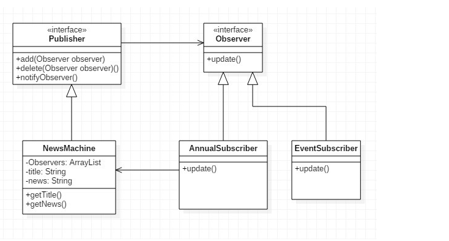

# Observer pattern

# example

* Observer : 관찰할 수 있는 메소드 제공
* User1 -> Observer : Observer 제공 메소드 결합하여 notify 대기
* User2 -> Observer : Observer 제공 메소드 결합하여 notify 대기
* Notice (Publisher): List<Observer> 관리(add, delete) 및 Observer 제공 메소드(notify) 실행
* Main : 실사용 (Notice 에 User1, User2 넣어줘서, notify 진행 )